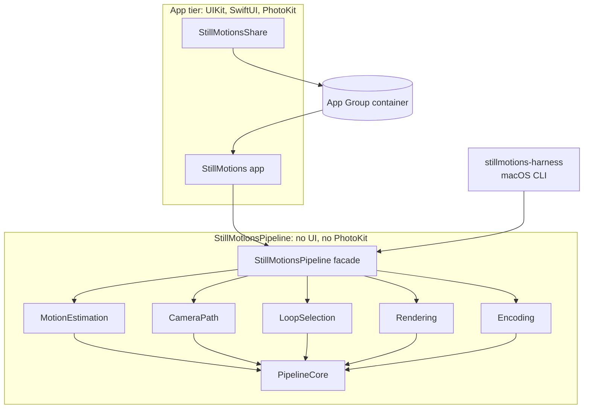
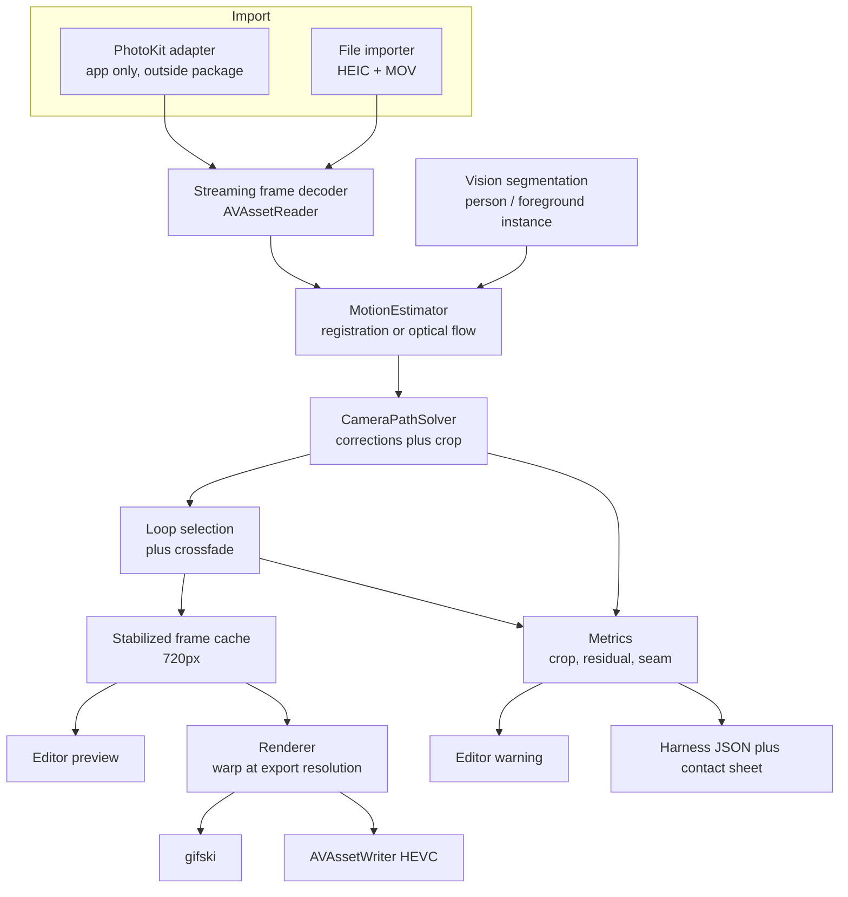
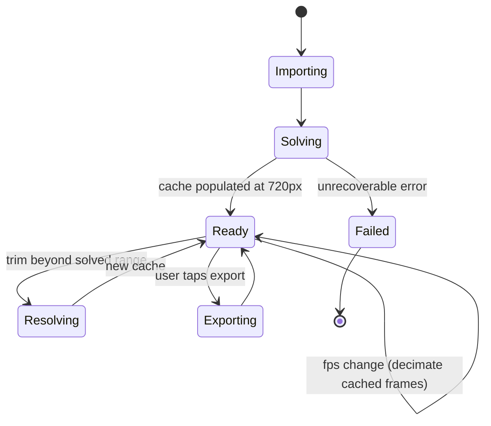
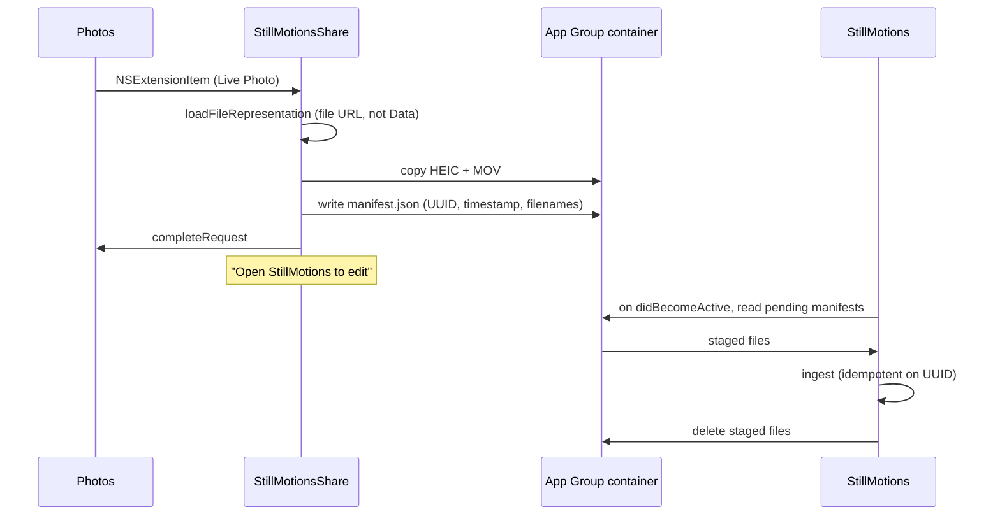
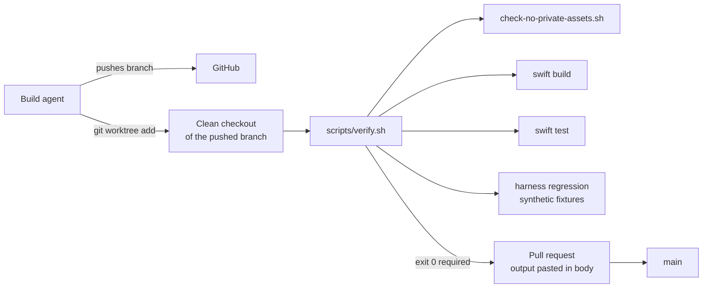

# StillMotions — Architecture

Companion to [PRD.md](PRD.md). This document describes structure; the PRD describes
behaviour and thresholds. Contested choices live in [decisions/](decisions/).

---

## 1. Targets and layout

Three build products and one package:

| Product | Kind | Bundle ID | Links gifski |
| --- | --- | --- | --- |
| `StillMotions` | iOS app, iOS 27.0+ | `com.began.StillMotions` | yes |
| `StillMotionsShare` | Share extension | `com.began.StillMotions.Share` | **no** |
| `StillMotionsPipeline` | Local SwiftPM package | — | yes (macOS + iOS) |
| `stillmotions-harness` | macOS CLI, in the package | — | yes (macOS) |

The extension deliberately does not link gifski — it performs no encoding
([0003](decisions/0003-extension-strategy.md)), so the Rust static library stays out of its
binary and the AGPL surface stays in one target.

```
StillMotions/
├── project.yml                  XcodeGen manifest (0006). .xcodeproj is gitignored.
├── Package.swift                StillMotionsPipeline
├── Brewfile                     pinned xcodegen
├── App/
│   ├── StillMotions/            app sources, SwiftUI
│   └── StillMotionsShare/       extension sources
├── Sources/
│   ├── PipelineCore/            shared value types, protocols, no platform deps
│   ├── MotionEstimation/        MotionEstimator implementations
│   ├── CameraPath/              CameraPathSolver implementations
│   ├── LoopSelection/           loop point search, crossfade
│   ├── Rendering/               Core Image / Metal warp, frame streaming
│   ├── Encoding/                gifski + AVAssetWriter encoders
│   ├── CGifski/                 module map over the xcframework
│   ├── StillMotionsPipeline/    public façade — the only module the app imports
│   └── HarnessCLI/              stillmotions-harness executable
├── tests/
│   ├── PipelineTests/           unit tests (note: lowercase, see §8)
│   └── fixtures/
│       ├── synthetic/           committed, known ground truth
│       └── personal/            GITIGNORED, never committed
├── harness/baseline.json        regression baseline
├── scripts/
│   ├── verify.sh                single verification entry point
│   ├── build-gifski.sh          builds Vendor/Gifski.xcframework
│   ├── check-no-private-assets.sh
│   └── teardown-runner.sh       cleanup only; removes a GitHub Actions runner
├── Vendor/Gifski.xcframework    GITIGNORED build artifact
└── docs/
```

The app imports only `StillMotionsPipeline`. Internal modules are implementation detail, so
the pipeline's internals can be restructured without touching app code.

---

## 2. Dependency direction



Two rules, both enforceable:

1. **Nothing in `Sources/` imports UIKit, SwiftUI, or PhotoKit** (PRD R-24). The package
   builds on macOS, which is what lets the harness measure quality without a phone.
2. **The extension never imports the pipeline.** It copies files and exits. If it ever
   imports `StillMotionsPipeline`, the drop-box decision has been violated.

The harness and the app call the *same* façade. This is what makes headless measurement
meaningful: the harness is not a parallel implementation.

---

## 3. Pipeline data flow



Stages, and what each owns:

1. **Import** — paired still and video. PhotoKit lives in the app; the package takes files
   only. The still's timestamp is the default reference frame index.
2. **Decode** — `AVAssetReader` yields frames one at a time. Never a full frame array.
3. **Segmentation** — optional masks so movers do not drive the camera estimate.
   Skipped when the mask exceeds 60% of frame area (PRD R-6): past that there is too little
   background left to register against.
4. **Motion estimation** — one `FrameMotion` per frame, behind a protocol
   ([0001](decisions/0001-motion-estimation.md)).
5. **Camera path** — corrections plus the largest crop valid across all frames
   ([0002](decisions/0002-camera-path-solver.md)).
6. **Loop selection** — best loop pair plus crossfade. Skipped for Bounce and Once.
7. **Frame cache** — stabilized frames at preview resolution (§5).
8. **Render** — warp at export resolution, streaming.
9. **Encode** — gifski or `AVAssetWriter` ([0004](decisions/0004-gifski-integration.md),
   [0005](decisions/0005-looping-export.md)).

**Metrics branch off the same stages that produce the output**, so the harness verdict and
the editor warning are the same numbers from the same code (PRD R-22). A discrepancy
between what the harness reports and what the editor warns about would mean a bug, not a
configuration difference.

---

## 4. Key protocols

`PipelineCore` owns the vocabulary. These four types are the seams the whole design rests
on, and they are the ones to read first.

```swift
public struct Correspondence {
    public let from: CGPoint
    public let to: CGPoint
}

public struct FrameMotion {
    public let index: Int
    public let transform: simd_float3x3
    /// Empty when the estimator does not produce correspondences.
    public let correspondences: [Correspondence]
    /// Fraction agreeing with `transform`. `nil` when not measurable.
    public let inlierRatio: Double?
}

public protocol MotionEstimator {
    func estimate(frame: CVPixelBuffer, reference: CVPixelBuffer) throws -> FrameMotion
}

public struct CameraPath {
    public let corrections: [simd_float3x3]
    public let crop: CGRect
    public let cropRetention: Double
}

public protocol CameraPathSolver {
    func solve(motion: [FrameMotion], frameSize: CGSize) throws -> CameraPath
}
```

`inlierRatio` is **`nil`, not `1.0`**, when the estimator cannot measure it. Vision
registration returns a matrix with no evidence behind it; a sentinel of `1.0` would claim
confidence that does not exist, and failure detection would silently trust it. Code must
handle the `nil` case explicitly.

---

## 5. Editor state and the preview cache

The design principle: **the expensive operation runs once, and the cheap interactions are
genuinely cheap** ([PRD R-15](PRD.md)).



After the solve, the cache holds stabilized frames at **720 px long edge**:

| Interaction | Cost | Mechanism |
| --- | --- | --- |
| Crop | free | Changes which rectangle of cached frames is displayed |
| Trim within solved range | free | Changes an index range |
| Frame rate | free | Decimates cached frames |
| Mode switch | free | Loop/Bounce/Once are playback orders over the same cache |
| Trim beyond solved range | re-solve | Debounced 300 ms, **old preview keeps playing** |

Automatic trim and crop are **initial editable state, not a final render** — the brief is
explicit on this and it is the reason the state machine has no "rendered" state before
export.

Two consequences worth stating:

- Medium preset (720 px) equals the cache resolution, so exporting Medium can reuse cached
  frames. Small downsamples from cache. **Full re-renders from source** at native
  resolution, which is why the export budget (10 s) is five times the preview budget.
- A re-solve never blanks the preview. Replacing a working preview with a spinner during a
  trim drag is the single worst thing this UI could do, so the old cache is retained until
  the new one is ready.

---

## 6. Extension memory strategy

Full rationale in [0003](decisions/0003-extension-strategy.md).



Rules the extension must not break:

- **File copies only.** `loadFileRepresentation`, never `loadDataRepresentation`. Never
  `UserDefaults` as a transport.
- **No pipeline import, no encoding, no decode.** A file copy has a kilobyte-scale memory
  profile; anything else risks the ceiling.
- **No launch attempt.** `NSExtensionContext.open(_:)` is unsupported for share extensions
  and the responder-chain hack fails on current iOS.
- **Budget ≤ 100 MB peak** against an undocumented ~120 MB limit that is a high-water mark
  and unconfirmed on iOS 27 (PRD §1.3).

App-side drain: idempotent on manifest UUID, deletes on success, discards manifests older
than 7 days so repeated shares without opening the app cannot grow the container without
bound.

---

## 7. Encoding stack

| Format | Encoder | Notes |
| --- | --- | --- |
| GIF | gifski via C API | Per-frame palettes, temporal dithering. `repeat = 0` for infinite loop. `gifski_set_write_callback` streams output so peak memory is flat in clip length. |
| MP4 | `AVAssetWriter`, HEVC | Source frame rate. No loop flag written — none is honoured ([0005](decisions/0005-looping-export.md)). |

gifski reaches Swift through `Sources/CGifski`, a module map over
`Vendor/Gifski.xcframework`, built by `scripts/build-gifski.sh` for
`aarch64-apple-darwin`, `aarch64-apple-ios`, and `aarch64-apple-ios-sim`. The artifact is
gitignored; the script is the record ([0004](decisions/0004-gifski-integration.md)).

The gifski version is **pinned in the script**. An unpinned encoder makes the regression
baseline meaningless, since output size and dithering would drift underneath it.

---

## 8. Two traps that will bite

**Case-insensitive filesystem.** macOS APFS is case-insensitive by default, so SwiftPM's
conventional `Tests/` and the brief-mandated `tests/fixtures/` are the **same directory**.
Everything therefore lives under lowercase `tests/`, with test targets declared using
explicit `path:` in `Package.swift`. Do not create `Tests/` — it will silently merge with
`tests/` and produce baffling build errors.

**`xcodegen generate` before any `xcodebuild`.** `.xcodeproj` is not in git. A missing
generate step surfaces as "scheme not found", which reads like a project problem rather
than a missing step. `scripts/verify.sh` handles it; ad-hoc `xcodebuild` invocations must
too. Note that CI never builds the app — only `swift build`/`swift test`, which need no
generator ([0006](decisions/0006-project-generator.md)).

---

## 9. Verification topology



`scripts/verify.sh` is the **single entry point** for verification.

**There is no CI.** No GitHub Actions workflow, no runner, no status checks, no branch
protection. Branch protection on a private repository requires GitHub Pro and rulesets require an
organization on GitHub Team, so no free option existed; rather than keep a runner whose verdict
nothing enforced, the setup was dropped in favour of making the agent's own verification harder
to get wrong.

The one mechanical safeguard left is that the agent runs verification from a **clean worktree of
the pushed branch**, not from its working directory. That is deliberate and it catches a specific
failure: a source file that exists on the agent's disk but was never committed. Verified in
place, that passes forever; verified from a fresh checkout, it fails at once. The other common
cases it catches are stale `.build/` products and leftover state in `/tmp`.

What is not covered, stated plainly because nothing else covers it: nothing enforces that the
agent verifies at all, so the pull request bodies are the audit trail and they are written by the
agent doing the work. The iOS app is never built by verification, only the package, so app
correctness rests on the `human` on-device issues. And real stabilization quality is judged by
reading contact sheets rather than by any gate.

Verification deliberately does **not** run `xcodebuild`. Signing needs keychain unlock and is
exactly the kind of thing that fails in the middle of a long unattended session. App builds
belong to the `human` on-device verification issues. Operational commands are in
[RUNBOOK.md](RUNBOOK.md).
