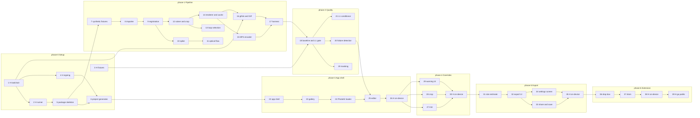

# Roadmap

An index of milestones and issues so the dependency graph is readable in one place. It
deliberately does not restate issue content — open the issue.

Task-selection rule and merge policy: [CLAUDE.md](../CLAUDE.md) "The task loop".

`H` = `human`, developer-only. The build agent stops when one of these blocks its next task.

---

## Critical path

---

## Milestones

### phase-0 Setup — 6 issues, 4 human

| # | Issue | Blocked by |
| --- | --- | --- |
| 1 | `H` Build machine setup: Xcode 27, XcodeGen, Rust, make repo private | — |
| 2 | `H` Register self-hosted runner, disable sleep, enable branch protection | 1 |
| 3 | `H` Export 30-50 personal Live Photo fixtures | — |
| 4 | `H` Configure signing, bundle identifiers, and the App Group | 1 |
| 5 | Confirm package skeleton builds and tests; verify.sh green in CI | 2 |
| 6 | Generate Xcode project; app and extension build and launch on device | 4, 5 |

**Do all four human issues in one sitting.** #3 and #4 have no dependency on the build and
are front-loaded deliberately: with them done, the agent runs from #5 to #25 — 21 issues —
without stopping.

### phase-1 Pipeline — 11 issues

| # | Issue | Blocked by |
| --- | --- | --- |
| 7 | Synthetic fixture generator with known motion truth | 5 |
| 8 | Live Photo file importer and streaming frame decoder | 7 |
| 9 | MotionEstimator protocol and Vision registration estimator | 8 |
| 10 | `spike` Optical flow cost vs registration accuracy, resolve decision 0001 | 9 |
| 11 | Optical flow estimator: grid sampling and RANSAC | 10 |
| 12 | CameraPathSolver protocol, warp-to-reference, largest valid crop | 9 |
| 13 | Loop point selection and crossfade | 12 |
| 14 | Streaming renderer and stabilized frame cache | 12 |
| 15 | MP4/HEVC encoder: bounce and once | 14 |
| 16 | gifski xcframework and GIF encoder: loop, bounce, once | 1, 14 |
| 17 | Harness CLI: metrics, contact sheets, baseline regression check | 15, 16 |

### phase-2 Quality — 4 issues

| # | Issue | Blocked by |
| --- | --- | --- |
| 18 | Establish quality baseline on personal fixtures; evaluate the L1 gate | 3, 17 |
| 19 | Subject masking: person and foreground instance segmentation | 18 |
| 20 | Stabilization failure detection as a pipeline result | 18 |
| 21 | `conditional` L1-optimal camera path solver | 18 |

#18 is the hinge of the project: it produces the committed baseline and decides whether #21
gets built at all.

### phase-3 App shell — 5 issues, 1 human

| # | Issue | Blocked by |
| --- | --- | --- |
| 22 | App shell: navigation, settings store, authorization | 6 |
| 23 | Live Photo gallery grid, newest first | 22 |
| 24 | PhotoKit paired-resource loader into pipeline input | 23 |
| 25 | Editor: preview playback, mode switching, frame cache | 20, 24 |
| 26 | `H` On-device verification: gallery and editor | 25 |

### phase-4 Overrides — 4 issues, 1 human

| # | Issue | Blocked by |
| --- | --- | --- |
| 27 | Manual trim override with debounced re-solve | 26 |
| 28 | Manual crop override constrained to the valid region | 26 |
| 29 | Non-blocking stabilization failure warning | 26 |
| 30 | `H` On-device verification: manual trim and crop overrides | 27, 28, 29 |

### phase-5 Export — 5 issues, 1 human

| # | Issue | Blocked by |
| --- | --- | --- |
| 31 | Output size estimation model | 30 |
| 32 | Export UI: format, preset, frame rate, live size estimate | 31 |
| 33 | Export to share sheet and Photos, with progress and cancel | 32 |
| 34 | Settings screen for defaults and preset values | 32 |
| 35 | `H` On-device verification: exports, iMessage GIF loop, LOOP atom experiment | 33, 34 |

### phase-6 Extension — 4 issues, 2 human

| # | Issue | Blocked by |
| --- | --- | --- |
| 36 | Share extension drop box and manifest | 35 |
| 37 | App-side pending item drain, idempotent with expiry | 36 |
| 38 | `H` On-device verification: share from Photos | 37 |
| 39 | `H` Go public: deregister runner, drop required check, flip visibility | 38 |

---

## Human issues, all nine

| # | What it needs from you | When |
| --- | --- | --- |
| 1 | Install Xcode 27, XcodeGen, Rust; make the repo private | Now |
| 2 | Register the runner as a service, disable sleep, enable branch protection | Now |
| 3 | Export 30-50 Live Photos from Photos on the Mac | Now |
| 4 | Signing, bundle IDs, App Group in the developer portal and Xcode | Now |
| 26 | Phone in hand: gallery and editor | After phase 3 |
| 30 | Phone in hand: trim and crop feel | After phase 4 |
| 35 | Phone in hand: exports, and does the GIF loop in Messages | After phase 5 |
| 38 | Phone in hand: share from Photos | After phase 6 |
| 39 | Deregister the runner, then make the repo public | Last |

---

## Decisions resolved during the build

Two are deliberately unresolved, each with a written deciding mechanism. Do not settle
either by picking one and moving on.

| Decision | Resolved by | Record |
| --- | --- | --- |
| Registration vs optical flow | #10, measured; device numbers confirmed in #26 | [0001](decisions/0001-motion-estimation.md) |
| Whether the L1 solver is needed | #18's crop-retention gate; #21 built or closed | [0002](decisions/0002-camera-path-solver.md) |
| Does the QuickTime `LOOP` atom work in iMessage | #35, empirically | [0005](decisions/0005-looping-export.md) |
| Real extension memory ceiling on iOS 27 | #36, measured on the iPhone 14 Pro | [0003](decisions/0003-extension-strategy.md) |
| Live Photo source frame rate, 15 vs 30 | #8, measured | [PRD §8](PRD.md) |
